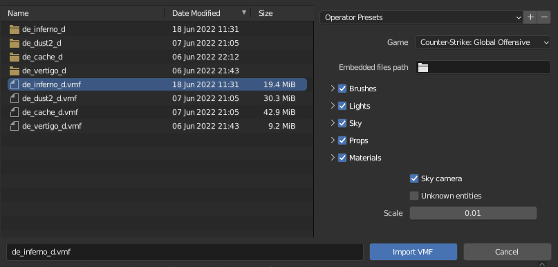
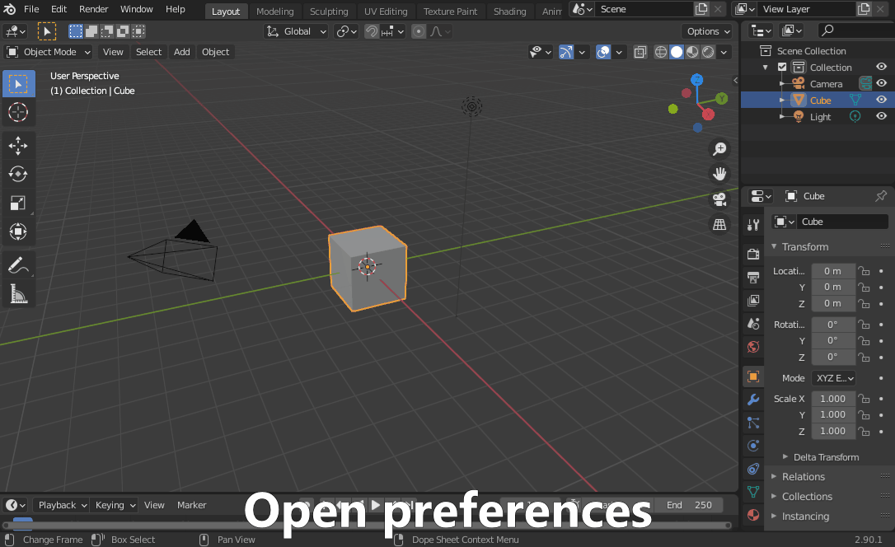

# Plumber

A Blender addon for importing Source 1 engine maps, models, materials and textures.

This addon makes it possible to import full CS:GO, TF2, CS:S or other Source 1 game maps into Blender.
Source 2 games, such as CS2, are not supported.
The imported maps have accurate materials and overlays and correctly placed props and lights.
Skyboxes are converted into a Blender-compatible format
and 3D skyboxes can be easily transformed into the correct position and scale with minimal user intervention.
No manual game file extraction is required and installed Source games on Steam are detected automatically.
You just need to select the correct game and start importing.

Supported file types are `.vmf`, `.mdl`, `.vmt` and `.vtf`. For a more complete overview of supported features, see [Supported features for imported assets](https://github.com/lasa01/Plumber/wiki/Supported-features-for-imported-assets).

## Table of contents
- [Requirements](#requirements)
- [Quick start](#quick-start)
- [Installation](#installation)
    - [Installing latest from source (very advanced users)](#installing-latest-from-source-very-advanced-users)
- [Usage](#usage)
    - [Detecting new Steam games](#detecting-new-steam-games)
    - [Importing from old CS:GO installation](#importing-from-old-csgo-installation)
    - [Common import options](#common-import-options)
    - [Maps](#maps)
    - [MDL](#mdl)
    - [Materials](#materials)
    - [Textures](#textures)
    - [Game file browser](#game-file-browser)
- [Troubleshooting](#troubleshooting)
- [Credits](#credits)
- [License](#license)

## Requirements
- OS: Windows recommended. Linux and macOS supported.
- Blender: 2.90 or newer (tested up to 4.1).

## Quick start
- Make sure you are using Blender 2.90 or newer.
- Install the latest release of this addon and enable it.
- Open the Blender console to get progress updates and start importing from the `File -> Import -> Plumber` menu.

## Installation
You can also follow a video tutorial, such as [this one](https://www.youtube.com/watch?v=jOJJzqOudw8) by ItsJustChris.
This tutorial is recorded using a beta version, but also applies to the current version.

- Make sure you are using Blender 2.90 or newer.
- Download the latest addon release from the [releases](https://github.com/lasa01/Plumber/releases) tab.
Make sure you download a file starting with `plumber-v1.x.x`, not the source code.
Also make sure that you downloaded the correct version for your operating system.
- Do **not** extract the downloaded files.
- Open Blender and install the addon:

### Installing latest from source (very advanced users)
Make sure the following dependencies for building the addon are installed.
The links are for Windows, for other platforms you need to figure it out yourself.
- [Python 3](https://www.python.org/downloads/) with "Add python to environment variables" selected in the installer
- [Git](https://git-scm.com/download/win) with "Git from the command line and also from 3rd-party software" selected in the installer
- [Rust language](https://www.rust-lang.org/tools/install) and the latest stable compiler
- [Microsoft C++ Build Tools](https://visualstudio.microsoft.com/visual-cpp-build-tools/) with "C++ MFC for latest build tools (x86 & x64)" selected in the installer under individual components.
- [CMake](https://cmake.org/download/)

After installing the dependencies, follow the following steps:
- Download the repository as a .zip from the green "Code" button in the top right corner and extract it somewhere (or alternatively, clone it).
- Run `pip install -r requirements-dev.txt` on a terminal.
- Run `python setup.py bdist_blender_addon`.
- The built addon will be in the `dist` directory.

## Usage

Installed Steam games are automatically detected on the first addon startup.
You can start importing immediately without any configuration required.
Just remember to select the correct game when importing files.

### Detecting new Steam games
If you have installed new Source games on Steam after installing the addon,
you will need to redetect the installed games.
This can be done from `Edit -> Preferences -> Add-ons -> Plumber`
by pressing the `Redetect installed games` button.

If you need to manually detect a game that is not installed in Steam,
you can use the `Detect from gameinfo.txt` button in the preferences.

### Importing from old CS:GO installation
If you have the old CS:GO files somewhere, it is possible to manually configure
a game to import old CS:GO assets.

You need to open preferences, and use the `Detect from gameinfo.txt` button.
This opens a file select dialog, where you need to choose the gameinfo.txt
file, which is present in `csgo` directory inside the old CS:GO installation.

### Common import options
- `Game`: Select the game you're importing assets from.

### Maps
`File -> Import -> Plumber -> Valve Map Format (.vmf)`

Source maps that ship with the game are in a compiled `.bsp` file format.
This addon can only import them in the original `.vmf` format.
You can use [BSPSource](https://github.com/ata4/bspsrc) to decompile the map files into the `.vmf` format supported by this addon.
BSPSource requires Java to be installed.
For CS:GO, the .bsp map files can be found inside
`Counter-Strike Global Offensive/csgo/maps/`.
They can also be easily extracted using the addon's game file browser.

When importing decompiled maps, overlay related errors
such as `overlay contains invalid uv data`
or `no geometry was imported for the sides the overlay was applied to`
can be safely ignored as BSPSource sometimes generates broken overlays.

Blender may appear frozen for a couple of seconds when importing complex maps.
To see possible errors in realtime, open the Blender console from `Window -> Toggle System Console` before importing.

Options:
- `Embedded files path`: You can generally leave this empty,
this will be automatically detected when importing decompiled maps.
- `Brushes`: Imports the "core" of the map: walls, floors etc.
    - `Overlays`: Imports overlays that are on top of solids, such as bomb site sprays.
    - `Epsilon`: You should not touch this.
    - `Cut threshold`: You should not touch this.
    - `Merge solids`: By choosing `Merge`, the importer will merge most of the map into
    a single object. 
    This can improve performance, but makes the map harder to edit and may cause issues
    in 3D sky transformation.
    - `Invisible solids`: By default, invisible solids are not imported.
    If you want, you can import them by changing this.
- `Lights`: Imports point lights and spotlights and the environment light (the sun).
    - `Brightness factors`: Controls how the brightnesses are converted into Blender. The default values are not fully accurate but good enough for most use cases.
- `Sky`: Imports the skybox as the world background.
    - `Sky output height`: Controls the quality of the imported sky.
    The skybox is converted into a different format, so quality might suffer if this is set too low.
    The default setting is 0, which automatically calculates an optimal resolution.
- `Props`: Imports all complex models in the map, such as cars and crates.
    - `Dynamic props`: The alternate options here remove more complex prop setups.
    This is useful when exporting the map into different software,
    since animated props may cause issues. `Remove armatures` should be usually used when exporting.
- `Materials`: Imports materials for solids, overlays and props.
    - See [Materials](#materials) for more options.
- `Sky camera`: Imports the origin point of the 3D sky used in 3D skybox transforming.
- `Unknown entities`: Imports other, unsupported entities as simple empty objects.
- `Scale`: Adjusts the scale everything is imported at.
The default is 0.01, but 0.0254 can be used for a more realistic scale.

Transforming the 3D sky
- After the import has finished, you need to manually select every object that belongs to the 3D sky.
- The 3D sky is usually clearly outside the main map area and in much smaller scale.
- Ensure you have the 3D sky origin (sky_camera) selected as the active object, and press `Object -> Transform VMF 3D sky` to transform the objects into the correct position and scale.

### MDL
`File -> Import -> Plumber -> Source Model (.mdl)`

Options:
- `Materials`: Imports materials for the model.
    - See [Materials](#materials) for more options.
- `Import animations`: Imports included animations for the model.
Note: some animations are currently unsupported.
- `Scale`: Adjusts the scale the model is imported at.
The default is 0.01, but 0.0254 can be used for more realistic scale.

### Materials
`File -> Import -> Plumber -> Valve Material Type (.vmt)`

Options:
- `Simple materials`: You should enable this if you plan on exporting outside Blender.
This will disable advanced features such as blended materials.
- `Texture format`: Selects the file format for imported textures.
Can be changed to TGA for better import performance, at the cost of higher memory usage.
- `Texture interpolation`: Selects the interpolation type for textures, the default value is a good choice.
- `Allow backface culling`: You can enable this if you know you need it.
- `Import editor materials`: Imports the materials visible inside Hammer instead of invisible materials for tool materials etc.

### Textures
`File -> Import -> Plumber -> Valve Texture Format (.vtf)`

The texture is imported as an image in Blender, and is not immediately visible after import.
It can be used in materials with a Image Texture node, for example.

### Game file browser

Game file browser allows you to import models, materials or textures straight from the game files,
or to extract any game files.

Can be accessed from the 3D view side bar under Plumber (recommended),
or alternatively from `File -> Import -> Plumber -> Browse game files`.

The browser only browser supported file types by default.
This can be changed to display all files by opening the arrow on the lower left corner of the file list.

## Troubleshooting
The [FAQ](https://github.com/lasa01/Plumber/wiki/FAQ-(Plumber)) has instructions for dealing with some common problems and errors.

If you can't find your problem there, you can ask on the [AGR TechSupport Discord's](https://discord.gg/wd8Rcdj) #blender channel or open a new issue.
When asking for help, always remember to open the Blender console from `Window -> Toggle System Console` before importing and to send the console logs afterwards with the help request by copy-pasting.

## Credits
- Me for the addon, [backing library](https://github.com/lasa01/plumber_core) and [VTFLib wrapper](https://github.com/lasa01/vtflib2-rs).
- Nemesis for original [VTFLib](https://github.com/NeilJed/VTFLib) and panzi for a Linux-compatible port, and me for a version that is easier to run multi-threaded.

MDL reading is based on:
- ZeqMacaw's [Crowbar](https://steamcommunity.com/groups/CrowbarTool)
- REDxEYE's [SourceIO](https://github.com/REDxEYE/SourceIO)
- Artfunkel's [Blender Source Tools](http://steamreview.org/BlenderSourceTools/)

Skybox conversion is based on:
- Alex Flint and Pete Florence's [bilinear interpolation code](https://stackoverflow.com/a/12729229).
- adamb70's [Python-Spherical-Projection](https://github.com/adamb70/Python-Spherical-Projection).

Also thanks to:
- Devostated for testing and bug reporting.
- Everyone else who reported bugs or suggested improvements.

## License
This project is licensed under the MIT license. See LICENSE for more information.
